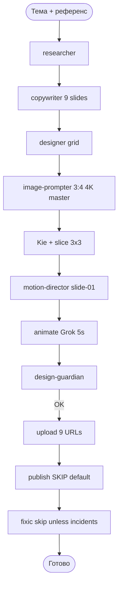

# Carusel — Пайплайн Instagram Carousel (9 slides, grid 3×3)

## Формат

| Параметр | Значение |
|----------|----------|
| Слайдов | **9** |
| Генерация | **1** Kie task `3:4` @ `4K` |
| Нарезка | **3×3** grid |
| Анимация | **slide-01** only |

## Шаги

| # | Agent | Выход |
|---|-------|-------|
| 4 | carusel-image-prompter | `CAROUSEL_IMAGE_PROMPT.json` (grid_3x3) |
| 5 | carusel-slice | 9× PNG |
| 6 | carusel-motion-director | `CAROUSEL_VIDEO_PROMPT.json` |
| 7 | carusel-animate | `slide-01.mp4` |
| 8 | carusel-design-guardian | QA ×9 |
| 9 | carusel-upload | `publish-urls.json` (file1–file9) |
| 10 | carusel-publish | video + 8 images |
| 11 | carusel-fixic | incidents |

Документация: `shared/carousel-grid-design.md`

Оркестрация: `shared/swarm-spawn-contract.md`. Director только оркестрирует.
**Весь человеческий текст = Gemini** (`written_by: gemini` на dossier, 9 слайдах, caption).
researcher + copywriter spawn: `Task(generalPurpose, model=gemini-3.7-flash-high)` на cloud.
Opus/Sonnet/Composer как автор текста = gate FAIL.
publish по умолчанию skip. Сухой прогон без PNG:

`python scripts/pipeline_gate.py --workspace /tmp/carusel-dry-run dry-run --lang ru --force`

Пустые красивые посты 27.08: Director пропустил researcher+copywriter. Не повторять.
