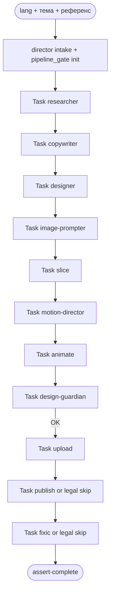

# Carusel — Пайплайн Instagram Carousel (9 slides, grid 3×3)

Director только оркестрирует. Каждый прямоугольник после intake — **отдельный Task**.

## Формат

| Параметр | Значение |
|----------|----------|
| Слайдов | **9** |
| Генерация | **1** Kie task `3:4` @ `4K` |
| Нарезка | **3×3** grid |
| Анимация | **slide-01** only, MP4 allowed |
| lang | `ru` `@todaytaro_ru` / `en` `@todaytaro_bot` |

## Шаги

| # | Agent | Выход | Как вызвать |
|---|-------|-------|-------------|
| 0 | director | `00-brief.md`, `pipeline-ledger.json` | parent intake + `pipeline_gate.py init` |
| 1 | carusel-researcher | `research/carousel-research-dossier.md` | Task |
| 2 | carusel-copywriter | `CAROUSEL_SLIDE_COPY.json`, caption | Task |
| 3 | carusel-designer | CAROUSELDESIGN + decomposition | Task |
| 4 | carusel-image-prompter | `CAROUSEL_IMAGE_PROMPT.json` | Task |
| 5 | carusel-slice | 9× PNG | Task |
| 6 | carusel-motion-director | `CAROUSEL_VIDEO_PROMPT.json` | Task |
| 7 | carusel-animate | `slide-01.mp4` | Task |
| 8 | carusel-design-guardian | QA ×9 | Task |
| 9 | carusel-upload | `publish-urls.json` | Task |
| 10 | carusel-publish | publish-log или legal skip | Task / skip |
| 11 | carusel-fixic | incidents или legal skip | Task / skip |

Машина: `shared/pipeline-steps.json`.  
Замок: `python scripts/pipeline_gate.py --workspace .`.

## Cloud

Plugin types `Task(carusel-*)` в cloud **не регистрируются**.  
Обход: `Task(generalPurpose)` × один шаг, пакет из `dispatch-prompt`.  
Это всё ещё 12 агентов, не новый рой.

Документация: `shared/carousel-grid-design.md`, `shared/director-dispatch-contract.md`, `shared/locale-brand-contract.md`.
