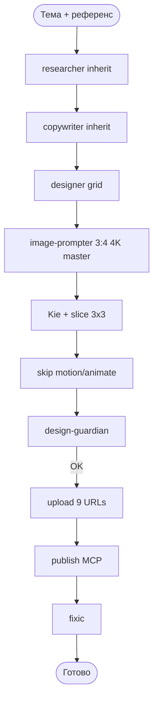

# Carusel — Пайплайн Instagram Carousel (9 slides, grid 3×3)

Первое чтение Директора: **`shared/director-once.md`**. Не крутить `scripts/pipeline_gate.py` / `scripts/composio_instagram_publish.py`.

## Формат

| Параметр | Значение |
|----------|----------|
| Слайдов | **9 + 9** (RU + EN) static PNG |
| Генерация | **1** Kie task `3:4` @ `4K` на язык |
| Нарезка | **3×3** grid |
| Лицо | **none** (без лица Вики) |
| Анимация | skip (`static-png-only`) |
| CTA | приложение (аудиоразбор), не бот |

## Шаги

| # | Agent | Модель / Роль | Выход |
|---|-------|---------------|-------|
| 1 | carusel-researcher | inherit (parent Gemini 3.8 Flash, reasoning_effort=low) | `carousel-researcher-dossier.md` |
| 2 | carusel-copywriter | inherit (parent Gemini 3.8 Flash, reasoning_effort=low) | `CAROUSEL_SLIDE_COPY.json`, `CAROUSEL_CAPTION.*` |
| 3 | carusel-designer | designer grid | `CAROUSELDESIGN.md` |
| 4 | carusel-image-prompter | `CAROUSEL_IMAGE_PROMPT.json` (grid_3x3) |
| 5 | carusel-slice | 9× PNG |
| 6 | carusel-motion-director | SKIP static-png-only |
| 7 | carusel-animate | SKIP static-png-only |
| 8 | carusel-design-guardian | QA ×9, FACE_CHECK ABSENT |
| 9 | carusel-upload | `publish-urls.json` (file1–file9) |
| 10 | carusel-publish | 9+9 PNG via Composio aliases |
| 11 | carusel-fixic | incidents |

## Текстовые роли (Правило Владимира 03.09.2026 + fix 04.09.2026)

- **Parent** Cloud Agent — только `gemini-3.8-flash` + `reasoning_effort=low`.
- high только если Владимир явно переопределил (`KARUSEL_REASONING_EFFORT`).
- **Researcher** и **copywriter** — Task с `model="inherit"`. НЕ передавать slug `gemini-3.8-flash` (его нет в каталоге воркеров).
- **NO DEFAULT FALLBACK:** Director / дефолтный агент **НИКОГДА** не пишет captions/slides/CTA сам. Нет fallback на Claude / GPT / Composer / Grok. Нет Gemini → только **FAIL + HOLE**.

## Как Холл будит рой

1. Стартовать Cloud Agent с **этого main** (не с `cursor/fix-gemini-worker-inherit-9eda`).
2. Модель родителя: `gemini-3.8-flash`, `reasoning_effort=low`.
3. Промпт: «Собери карусель на ДАТУ. Читай только `shared/director-once.md`. `new-day --date ДАТА`. Воркеры `model=inherit`. Не публикуй archive URL. Нет Task / 403 → hole и стоп. GATE PASS / READY → EXIT.»
4. Директор: `status` → при STALE `new-day --date СЕГОДНЯ` → `record-dispatch` → `dispatch-prompt` → **один** Task на шаг.
5. После slice сразу **design-guardian** (не motion/animate).
6. Publish только если brief `publish_requested: true` и Hall явно просила live. Иначе skip.

## Завтрашний слот 11:10

1. Parent: `gemini-3.8-flash` + `reasoning_effort=low`. Читать только `shared/director-once.md`.
2. `python scripts/pipeline_gate.py --workspace . status`
3. Если `STALE_LEDGER` / `next=new-day`: `new-day --date <сегодня ISO> --lang ru` — создаст `carusel-memory/packs/<сегодня>/` с `face_lock: none`. Не трогать `2026-08-30`.
4. Ledger уже `motion-director`/`animate` = `skipped: static-png-only`. Не диспатчить их.
5. Цикл CLI: `record-dispatch` → `dispatch-prompt` → **один** Task → `verify`. Не Read-loop `pipeline_gate.py` / `composio_instagram_publish.py`.
6. Цепочка: researcher (inherit) → copywriter (inherit) → designer → image-prompter → slice → design-guardian → upload `--static-all-pngs` → publish (skip unless asked).
7. `publish-urls.json` только от этого `run_id`. Archive permalinks запрещены. Live Instagram в этом PR не делать.
8. GATE PASS / READY → EXIT. Не ждать слот. Нет sleep/poll. Max 2 Read одного gate-файла, иначе FAIL.

## Anti-stale / anti-loop

- Вчерашний ledger с `next=done` — это **STALE**, не сегодняшняя карусель. Команда: `new-day`.
- В отчёт и `live-posts` писать только permalinks **текущего** API-прогона. `DcqJGCblQqv` / `DcqJS--m0op` и прочие чужие даты — запрещены как «сегодня».
- 403 / нет `tool_execution` → FAIL + `carusel-memory/HOLE.md`, без подстановки архива.
- После GATE PASS / READY Директор **выходит**. Не крутить Read `pipeline_gate.py` / `composio_instagram_publish.py`. Третий Read того же файла = FAIL + EXIT.
- Не sleep / poll в ожидании слота.

Документация: `shared/carousel-grid-design.md`, `shared/director-once.md`
