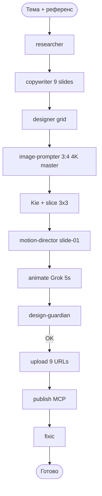

# Carusel — Пайплайн Instagram Carousel (9 slides, grid 3×3)

## Формат

| Параметр | Значение |
|----------|----------|
| Слайдов | **9** |
| Генерация | **1** Kie task `3:4` @ `4K` |
| Нарезка | **3×3** grid |
| Анимация | **slide-01** only |

## Шаги

| # | Agent | Модель / Роль | Выход |
|---|-------|---------------|-------|
| 1 | carusel-researcher | Gemini 3.8 Flash High (`reasoning_effort=high`, no fallback, only FAIL) | `carousel-researcher-dossier.md` |
| 2 | carusel-copywriter | Gemini 3.8 Flash High (`reasoning_effort=high`, no fallback, only FAIL) | `CAROUSEL_SLIDE_COPY.json`, `CAROUSEL_CAPTION.*` |
| 3 | carusel-designer | designer grid | `CAROUSELDESIGN.md` |
| 4 | carusel-image-prompter | `CAROUSEL_IMAGE_PROMPT.json` (grid_3x3) |
| 5 | carusel-slice | 9× PNG |
| 6 | carusel-motion-director | `CAROUSEL_VIDEO_PROMPT.json` |
| 7 | carusel-animate | `slide-01.mp4` |
| 8 | carusel-design-guardian | QA ×9 |
| 9 | carusel-upload | `publish-urls.json` (file1–file9) |
| 10 | carusel-publish | video + 8 images |
| 11 | carusel-fixic | incidents |

## Текстовые роли (Правило Владимира 03.09.2026 + 04.09.2026)

- **Researcher** и **copywriter** (текст карусели) — **только Gemini**: родитель запущен на `gemini-3.8-flash` + `reasoning_effort=high`, а текстовые Task спавнятся с `model="inherit"` (или без override). НЕ передавать slug `gemini-3.8-flash` в Task — его нет в worker catalog.
- **NO DEFAULT FALLBACK:** Дефолтный агент / director **НИКОГДА** не пишет captions/slides/CTA сам при недоступной Gemini. Никакого fallback на дефолтную модель — только FAIL.

Документация: `shared/carousel-grid-design.md`
